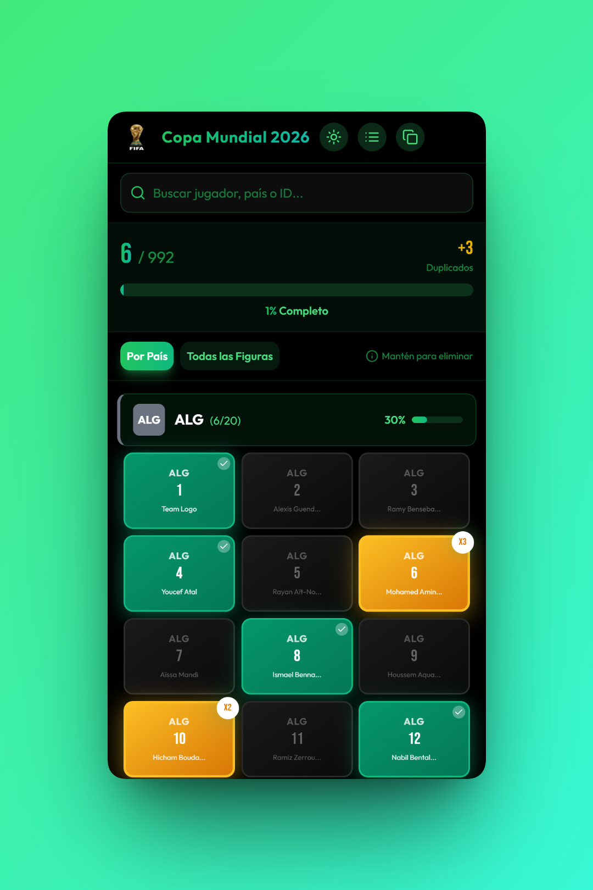

# World Cup Sticker Tracker

<p align="center">
  
</p>

A web-based tracker to manage your World Cup sticker album. See at a glance which stickers you have, which are missing, and which ones you have repeated — perfect for planning swaps with friends.

Built as a practice project using [opencode](https://opencode.ai) and free LLMs.

## Features

- **Bird's-eye view** of your entire sticker collection
- Track **missing** and **repeated** stickers
- **Progress tracking** with real-time stats (collected, duplicates, completion %)
- Connect from any device on the same WiFi
- Works great while filling your physical album — just check off stickers as you paste them in
- Persistent SQLite database — your progress is saved locally

## Getting Started

### Prerequisites

- [Node.js](https://nodejs.org/) (v18 or higher)
- [pnpm](https://pnpm.io/) (`npm install -g pnpm`)

### Installation

```bash
# Clone the repository
git clone https://github.com/yourusername/world-cup-sticker-tracker.git
cd world-cup-sticker-tracker

# Install dependencies
pnpm install

# Seed the database with stickers
pnpm run seed

# Start the server
pnpm run dev
```

The app will be available at **http://localhost:3001**

### Access from Other Devices on the Same WiFi

Since the server binds to `0.0.0.0`, you can access it from any device connected to the same network:

1. Find your machine's local IP address:
   - **Windows:** `ipconfig` — look for `IPv4 Address` under your active network adapter
   - **macOS/Linux:** `hostname -I`

2. On another device (phone, tablet, etc.), open:
   ```
   http://<YOUR_IP>:3001
   ```

### How to Use

1. Start the server (`pnpm run dev`)
2. Open the app in your browser
3. As you open sticker packs and paste stickers into your physical album, mark each one as **owned** in the tracker
4. Use the **Missing** and **Repeated** filters to find which stickers to look for or trade away

#### Interactions

| Device | Add Sticker | Remove Sticker |
|--------|-------------|----------------|
| **Desktop** | Left-click | Right-click |
| **Mobile** | Tap | Long-press (hold) |

- **Adding repeated stickers**: Click/tap on a sticker you already own to add another copy (e.g., for trading)
- The top bar shows your real-time progress: collected count, duplicates, and completion percentage
- Click the stats icon in the navigation for a detailed breakdown by team/position

## Tech Stack

- **Frontend:** React 18, Vite, Tailwind CSS
- **Backend:** Express, sql.js (SQLite in-memory with file persistence)
- **Testing:** Playwright

## License

This project is licensed under the MIT License — see [LICENSE](LICENSE) for details.
